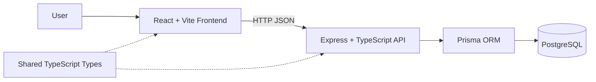

# Architecture

```mermaid
flowchart LR
  U[User] --> FE[React + Vite Frontend]
  FE -->|HTTP JSON| API[Express + TypeScript API]
  API --> ORM[Prisma ORM]
  ORM --> DB[(PostgreSQL)]
  SH[Shared TypeScript Types] -.-> FE
  SH -.-> API
```

The frontend communicates with the backend through REST endpoints. The backend validates incoming data and uses Prisma to access PostgreSQL.
