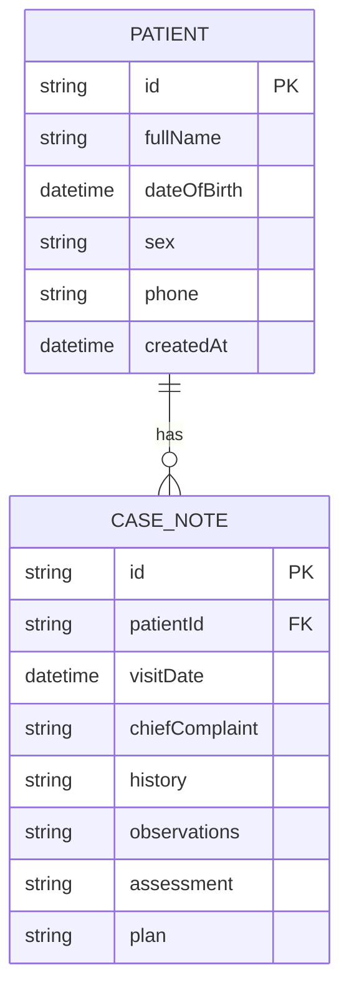

# Data Model

```mermaid
erDiagram
  PATIENT ||--o{ CASE_NOTE : has
  PATIENT {
    string id PK
    string fullName
    datetime dateOfBirth
    string sex
    string phone
    datetime createdAt
  }
  CASE_NOTE {
    string id PK
    string patientId FK
    datetime visitDate
    string chiefComplaint
    string history
    string observations
    string assessment
    string plan
  }
```

One patient can have multiple case notes. Deleting a patient cascades to their case notes in this starter schema.
